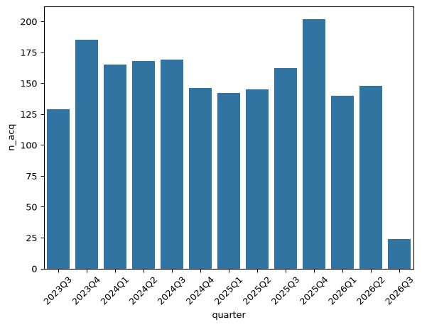
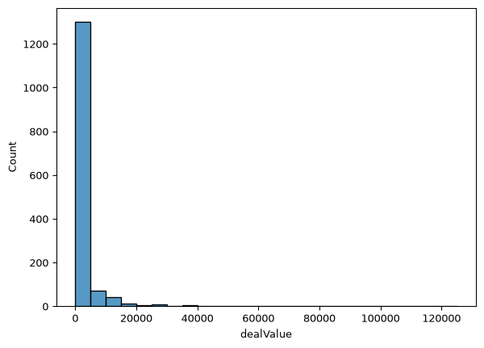
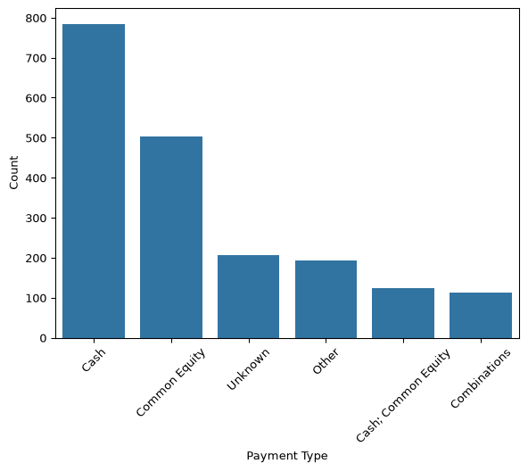
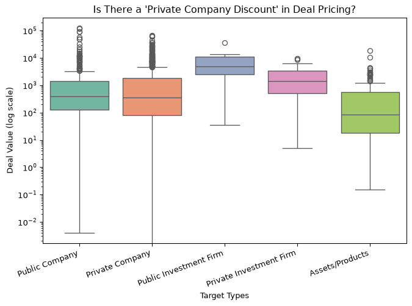

# PythonFinalProject


## Introduction/Dictionary

This is a final project for Python for Data Analytics by Benjamin Kim.
The Mergers and Acquisitions (M&A) data which I collected is from S&P
Capital IQ. For context, M&A is a corporate strategy to consolidate
companies or their major assets through financial transactions. In a
merger, the two companies combine to create a new entity, while an
acquisition is when one company absorbs another company. For this
project, I focused on the acquisition. I filtered the data so that:

- Announcement date is between January 1, 2021 and December 31, 2024
- Deal status is complete
- Geography is ‘United States’
- Deal size is greater than \$50 million

The data which I pulled from the website includes:

- Announcement Date: What day the acquisition announced; “Day 0”
- Buyers/Investors: Company which bought the other firm
- Target/Issuer: Firm which was bought
- Exhange Ticker: Short letter code of a target company
- Total Transaction Value: Gross deal value in millions of US dollars
- Transaction Type: “Merger/Acquisition”
- Consideration Offered: The payment method - Cash, stock, cash and
  stock
- Company Type: Whether the target company was a public, private, or a
  subsidiary at the time of the deal
- Industry Classifications \[Target/Issuer\]: Target company’s
  classification
- Industry Classifications \[Buyers/Investors\]: Buying company’s
  classification
- CIQ Transaction ID: Unique ID

## Importing Libraries and Data

``` python
import pandas as pd
import matplotlib.pyplot as plt
import numpy as np
import seaborn as sns
from scipy import stats

df = pd.read_csv('C:/Users/Ben_Kim1/Downloads/Transaction_Screening_Report_Cleaned.csv')
print(df.columns)
print(df.head())
```

    Index(['M&A Announced Date', 'Buyers/Investors', 'Target/Issuer',
           'Exchange:Ticker', 'Total Transaction Value ($USDmm, Historical rate)',
           'Transaction Types', 'Consideration Offered',
           'Company Type [Target/Issuer]',
           'Industry Classifications [Target/Issuer]',
           'Industry Classifications [Buyers/Investors]', 'CIQ Transaction ID'],
          dtype='str')
      M&A Announced Date                              Buyers/Investors  \
    0          7/22/2026          Repligen Corporation (NasdaqGS:RGEN)   
    1          7/21/2026                Intersnack Group GmbH & Co. KG   
    2          7/21/2026      First Financial Bancorp. (NasdaqGS:FFBC)   
    3          7/21/2026  Horace Mann Educators Corporation (NYSE:HMN)   
    4          7/20/2026              Magnolia Oil & Gas Operating LLC   

                                 Target/Issuer Exchange:Ticker  \
    0  BioLife Solutions, Inc. (NasdaqCM:BLFS)   NasdaqCM:BLFS   
    1              Utz Brands, Inc. (NYSE:UTZ)        NYSE:UTZ   
    2          Finward Bancorp (NasdaqCM:FNWD)   NasdaqCM:FNWD   
    3       Reserve National Insurance Company               -   
    4      Wildfire Intermediate Holdings, LLC               -   

      Total Transaction Value ($USDmm, Historical rate)   Transaction Types  \
    0                                           1631.82  Merger/Acquisition   
    1                                           2927.85  Merger/Acquisition   
    2                                            207.54  Merger/Acquisition   
    3                                               125  Merger/Acquisition   
    4                                           4127.85  Merger/Acquisition   

      Consideration Offered Company Type [Target/Issuer]  \
    0    Cash; Combinations               Public Company   
    1                  Cash               Public Company   
    2         Common Equity               Public Company   
    3                  Cash              Private Company   
    4   Cash; Common Equity              Private Company   

                Industry Classifications [Target/Issuer]  \
    0  Health Care (Primary); Life Sciences Tools and...   
    1  Consumer Staples (Primary); Food Products (Pri...   
    2  Banks (Primary); Banks (Primary); Financials (...   
    3  Financials (Primary); Health and Medical Insur...   
    4  Energy (Primary); Energy (Primary); Oil and Ga...   

             Industry Classifications [Buyers/Investors] CIQ Transaction ID  
    0  Health Care (Primary);\n\nLife Sciences Tools ...     IQTR2011781673  
    1  Bread and Bakery Products (Primary);\n\nBread,...     IQTR2011552433  
    2  Banks (Primary);\n\nBanks (Primary);\n\nFinanc...     IQTR2011683307  
    3  Financials (Primary);\n\nInsurance (Primary);\...     IQTR2011738431  
    4  Energy (Primary);\n\nEnergy (Primary);\n\nOil ...     IQTR2011347250  

## Rename the Columns

``` python
rename_dict = {
    "CIQ Transaction ID" :"ID",
    "M&A Announced Date": "announcedDate",
    "Buyers/Investors": "acquirerName",
    "Target/Issuer": "targetName",
    "Total Transaction Value ($USDmm, Historical rate)": "dealValue",
    "Transaction Types": "dealType",
    "Consideration Offered": "paymentType",
    "Company Type [Target/Issuer]": "targetCompanyType",
    "Industry Classifications [Target/Issuer]": "targetIndustry",
    "Industry Classifications [Buyers/Investors]": "acquirerIndustry",
    "Exchange Ticker [Buyers/Investors]": "acquirerTickerRaw",
    "Transaction Status": "dealStatus",
}

df = df.rename(columns = rename_dict)
df["announcedDate"] = pd.to_datetime(df["announcedDate"])
print(df.columns)
```

    Index(['announcedDate', 'acquirerName', 'targetName', 'Exchange:Ticker',
           'dealValue', 'dealType', 'paymentType', 'targetCompanyType',
           'targetIndustry', 'acquirerIndustry', 'ID'],
          dtype='str')

## Descriptive Stats

``` python
df["announce_year"] = df["announcedDate"].dt.year
df["announce_quarter"] = df["announcedDate"].dt.to_period("Q")
 
deals_by_year = df.groupby("announce_year").size()
deals_by_quarter = df.groupby("announce_quarter").size()
 
print("Deals per year")
print(deals_by_year)

print("Deals by quarter")
print(deals_by_quarter)
```

    Deals per year
    announce_year
    2023    314
    2024    648
    2025    651
    2026    312
    dtype: int64
    Deals by quarter
    announce_quarter
    2023Q3    129
    2023Q4    185
    2024Q1    165
    2024Q2    168
    2024Q3    169
    2024Q4    146
    2025Q1    142
    2025Q2    145
    2025Q3    162
    2025Q4    202
    2026Q1    140
    2026Q2    148
    2026Q3     24
    Freq: Q-DEC, dtype: int64

``` python
deals_q_df = pd.DataFrame(deals_by_quarter)
deals_q_df['quarter'] = deals_q_df.index
deals_q_df.columns = ['n_acq', 'quarter']
```

## Visualizations

``` python
sns.barplot(deals_q_df, x = 'quarter', y = 'n_acq')
plt.xticks(rotation=45) 
plt.show()
```



``` python
df['dealValue'] = (
    df['dealValue']
    .astype(str)
    .str.replace('$', '', regex=False)
    .str.replace(',', '', regex=False)
)
df['dealValue'] = pd.to_numeric(df['dealValue'], errors='coerce')
sns.histplot(df, x='dealValue', binwidth = 5000)
plt.show()
```



``` python
top5_types = df["paymentType"].value_counts().nlargest(5).index
df["paymentType_grouped"] = df["paymentType"].where(
    df["paymentType"].isin(top5_types), "Other"
)

payment_pct = (
    df["paymentType_grouped"].value_counts(normalize=True) * 100
).round(1)

print("Payment Method")
print(payment_pct.astype(str) + "%")


order = list(top5_types) + ["Other"]
bar_order = df["paymentType_grouped"].value_counts().index
sns.countplot(data=df, x="paymentType_grouped", order=bar_order)
plt.xlabel("Payment Type")
plt.ylabel("Count")
plt.xticks(rotation=45) 
plt.show()
```

    Payment Method
    paymentType_grouped
    Cash                   40.8%
    Common Equity          26.2%
    Unknown                10.8%
    Other                  10.1%
    Cash; Common Equity     6.4%
    Combinations            5.8%
    Name: proportion, dtype: str



``` python
summary_by_type = df.groupby("targetCompanyType")["dealValue"].agg(
    ["median", "mean", "count"]
).round(1)
print(summary_by_type)
 
public_vals = df.loc[df["targetCompanyType"] == "Public Company", "dealValue"].dropna()
private_vals = df.loc[df["targetCompanyType"] == "Private Company", "dealValue"].dropna()
 
if len(public_vals) > 1 and len(private_vals) > 1:
    t_stat, p_val = stats.ttest_ind(public_vals, private_vals, equal_var=False)
    print(f"\nt-test (log deal value, Public vs Private): t={t_stat:.2f}, p={p_val:.4f}")
    if p_val < 0.05:
        direction = "HIGHER" if public_vals.mean() > private_vals.mean() else "LOWER"
        print(f"--> Statistically significant: public targets get {direction} valuations (p<0.05)")
    else:
        print("N ot statistically significant at the 5% level")
else:
    print("\nNot enough data in one of the groups to run a t-test -- check your counts above")
 
exclude_types = ["Foundation/Charitable Institution", "Educational Institution", "Arts Institution", "Trade Association"]
plot_df = df[~df["targetCompanyType"].isin(exclude_types)].copy()
fig, ax = plt.subplots(figsize=(8, 5))
sns.boxplot(data=plot_df, x="targetCompanyType", y="dealValue",
                hue="targetCompanyType", palette="Set2", legend=False, ax=ax)
ax.set_yscale("log")
ax.set_title("Is There a 'Private Company Discount' in Deal Pricing?")
ax.set_xlabel("Target Types")
ax.set_ylabel("Deal Value (log scale)")
plt.xticks(rotation=20, ha="right")
plt.show()
```

                                       median    mean  count
    targetCompanyType                                       
    Arts Institution                      NaN     NaN      0
    Assets/Products                      85.0   739.2    145
    Educational Institution               NaN     NaN      0
    Foundation/Charitable Institution     NaN     NaN      0
    Private Company                     350.0  2323.8    925
    Private Investment Firm            1449.0  2560.9     29
    Public Company                      400.0  3341.5    345
    Public Investment Firm             4977.7  8430.7     10
    Trade Association                     NaN     NaN      0

    t-test (log deal value, Public vs Private): t=1.43, p=0.1543
    N ot statistically significant at the 5% level



Conclusion: In tech Merging & Acquisition over the last few years,
whether a target is public or private doesn’t appear to meaningfully
move the price acquirers pay.
